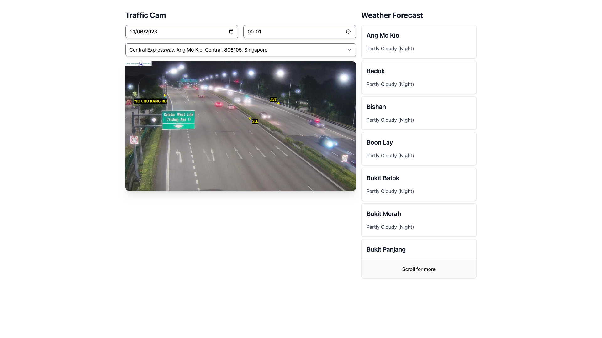

# Weather Forecast & Traffic Cam



## Installation
`pnpm` is required for this.

### Install `pnpm`
```shell
# For Node >16
corepack enable
corepack prepare pnpm@<version> --activate

# For Node <16
npm install -g pnpm
```
### Install packages
```shell
# Install the packages
pnpm install
```

## Usage

### Starting the both the server and client simultaneously
```shell
# Starts both the server and client
pnpm start
```

### Starting the server only
```shell
# Starts only the server
cd packages/server
pnpm start
```

### Starting the client only
```shell
# Starts only the client
cd packages/client
pnpm start
```


## Resources
- [Data.gov.sg](https://data.gov.sg)
  - [Traffic Images](https://data.gov.sg/dataset/traffic-images)
  - [Weather Forecast](https://data.gov.sg/dataset/weather-forecast)
- [Nominatim API by OpenStreetMap](https://nominatim.org/release-docs/latest/api/Reverse)
